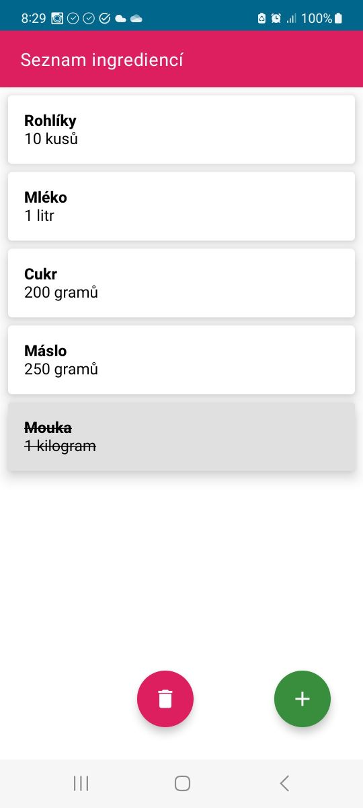

# Zadání: Aplikace nákupní seznam

Vytvořte Android aplikaci pro správu nákupního seznamu ingrediencí, která umožní uživatelům organizovat ingredience potřebné k vaření. Aplikace bude implementovat [**Room databázi**](https://developer.android.com/training/data-storage/room) a nabídne CRUD operace. Každou ingredienci dále bude možné označit jako „koupenou“ kliknutím. Označené ingredience se vizuálně odliší od ostatních (např. přeškrtnutím textu).

